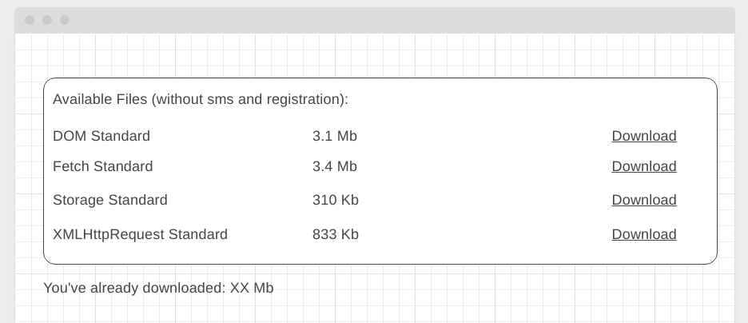

### [Gh-page](https://mksinc.github.io/AHJ-hw.-6-DnD.-3-Download-manager/)
# 6. Домашнее задание к лекции «Работа с файлами, DnD»

Правила сдачи задания:

1. **Важно**: в рамках этого ДЗ нужно использовать yarn (поэтому файла `package-lock.json` в репозитории быть не должно)
2. Всё должно собираться через Webpack (включая картинки и стили) и выкладываться на Github Pages через Appveyor
3. В README.md должен быть размещён бейджик сборки и ссылка на Github Pages
4. В качестве результата присылайте проверяющему ссылки на ваши GitHub-проекты
5. Авто-тесты писать не требуется

---

## 6.3 Download Manager (задача со звёздочкой)

Важно: эта задача не является обязательной

### Легенда

Вы делаете веб-интерфейс к облачному хранилищу данных (Dropbox, Google Drive, Yandex Disk, Mail.ru Облако), с которого можно скачивать книги (обратите внимание, никакого пиратского контента, только свободно распространяемый материал). И вам нужно реализовать интерфейс для скачивания средствами JS.

Подсказка: храните контент файлов предзашитым в виде DataURL в теле страницы (тяжёлые файлы специально убраны).

Но при этом также нужно показать пользователю, сколько мегабайт он уже скачал.

### Описание

Внешний вид должен выглядеть следующим образом:

PDF-файлы для реализации вы найдёте в каталоге files данного репозитория.

Обратите внимание, что скачивание должно производиться средствами JS и подсчёт количества скачанных мегабайт должен производиться на базе реально скачанного контента (а не тех размеров, что указаны в табличке).

При этом если одна книжка скачивается дважды, то и учитываться в обьёме скачанного она должна также дважды.
